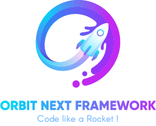
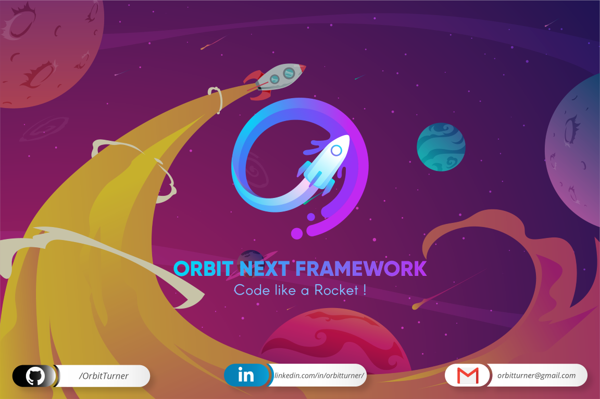

<p align="center">
  <a href="https://github.com/orbitturner/orbitnextframework"></a>
</p>

________

|  |  |  |  |
|:-:|:-:|:-:|:-:|
|  |  |  |  |


<p align="center">
<a href="https://github.com/orbitturner/orbitnextframework"></a>
</p>

#

<p>
<strong>This is a Funny Easy Simple Lighweight *🇸🇳* Senegalese *🇸🇳* PHP Framework that have been made to help Nebies and Pro devs to code in a different way.</strong>
</p>

<h1 align="center"># ABOUT ORBIT NEXT FRAMEWORK</h1>

**IT'S FIRST A FUNNY ADVENTURE !**
***"Orbit Next Framework"*** is not a mega framework like symfony or whatever.
Basically it was just a solution to solve a class project in OOP intended to deepen our knowledge in OOP in PHP.
Then by trying to find a simple methodology allowing to succeed in making an OOP PHP project without getting tired or obstinate in managing NAMESPACES, classes, entities; I decided to create a structure that will manage the bulk of the project in the background allowing us to focus on analysis and design.
**ONF is Based on the M-V-C (MVC) methodology** and draws much inspiration from the great and Premier Senegalese FrameWork: ❤ [**SAMANE MVC**](https://github.com/ngorseckframework/samanemvc) ❤.

### 🚧⚒⚠ ONF IS STILL ON PROGRESS AND NOT FULLY FINISHED ⚠⚒🚧


# REQUIREMENTS
- **PHP**       ✅: [`7.1 OR HIGHER`](https://www.php.net/)
- **MySQL**     ✅: [`Website`](https://www.mysql.com/fr/)
- **Composer**  ✅: [`For Doctrine ORM`](https://getcomposer.org/)


## SNEAK PEEK / DEMO OF A LIVE PROJECT
```
 *    ╔═╗╦═╗╔╗ ╦╔╦╗  ╔╗╔╔═╗═╗ ╦╔╦╗  
 *    ║ ║╠╦╝╠╩╗║ ║   ║║║║╣ ╔╩╦╝ ║   
 *    ╚═╝╩╚═╚═╝╩ ╩   ╝╚╝╚═╝╩ ╚═ ╩   
 *    ╔═╗╦═╗╔═╗╔╦╗╔═╗╦ ╦╔═╗╦═╗╦╔═   
 *    ╠╣ ╠╦╝╠═╣║║║║╣ ║║║║ ║╠╦╝╠╩╗   
 *    ╚  ╩╚═╩ ╩╩ ╩╚═╝╚╩╝╚═╝╩╚═╩ ╩   
```
*Comming Soon !*


## ❤🚀 Contributions & Pull Request 🚀❤
😊✌❤ WE ARE ALWAYS WAITING FOR YOUR PULL REQUESTS ❤✌😊
💠🏗 Contributions are always welcome too !🌌💠🏗
Please read the [contribution guidelines](public/assets/contributing.md) first.

## License

[](https://creativecommons.org/publicdomain/zero/1.0/)

To the extent possible under law, [Orbit Turner](http://orbitturner.yj.fr) has waived all copyright and related or neighboring rights to this work.


______________________________________________________
**❤ WITH LOVE BY ❤** : Mohamed GUEYE (OrbitTurner).


